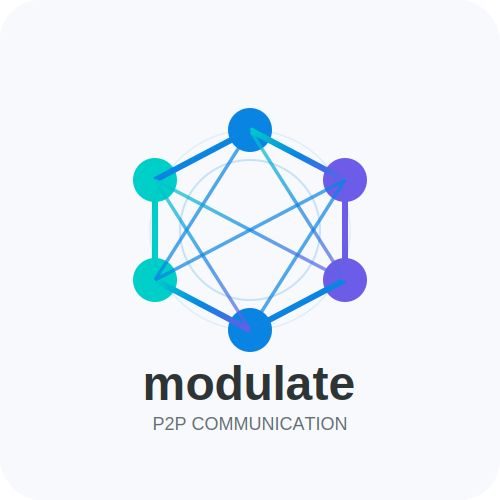

[](https://crates.io/crates/modulate-comms)
[](https://crates.io/crates/modulate-comms)
[](https://docs.rs/modulate-comms/latest/modulate-comms/)

# modulate-comms - P2P Chat Application

modulate-comms is a peer-to-peer chat application with group chat functionality, built using Rust and WebRTC.

## Features

### Current

- Peer-to-peer communication using WebRTC
- No central server needed for messaging
- End-to-end encryption
- Low latency messaging

### Planned

- Unit tests
- Clean api to allow 3rd party usage with creation of library instead of just app
- Room mesh based comms
- User management (still conceptualizing how this will work)
- Video, audio, file management
- Basic front end for usability
- Centrailized system to act as a signaling server

## Setup

### Prerequisites

- Rust toolchain (1.70.0 or newer)
- Cargo package manager

### Installation

1. Clone the repository:

```bash
git clone https://github.com/dresio/modulate-comms.git
cd modulate-comms
```

2. Build the application:

```bash
cargo build
```

3. Run the application:

```bash
./target/release/modulate-comms --help
```

## Usage

### Direct Connection Mode

#### Offerer (initiates the connection):

```bash
./target/release/modulate-comms offer
```

#### Answerer (waits for an offer):

```bash
./target/release/modulate-comms answer
```

### Group Chat Mode (Experimental)

```bash
./target/release/modulate-comms group --max-peers 5
```

## Chat Commands

Once in a chat session, the following commands are available:

- `/exit` or `/quit` - Exit the chat
- `/help` - Show help message
- `/status` - Show connection status
- `/clear` - Clear the screen
- `/history` - Show message history

## Project Structure

"WIP"

## Implementation Details

"WIP"

## License

Following in line with many rust packages, modulate-comms is dual licensed under <a href="LICENSE-APACHE.txt">Apache License, Version
2.0</a> or <a href="LICENSE-MIT.txt">MIT license</a> which you can choose either.  
Please note some crates this depends on have other license, which can typically be found in their README files underneath the License header.
